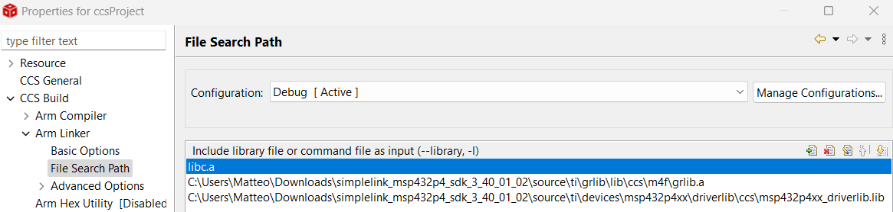
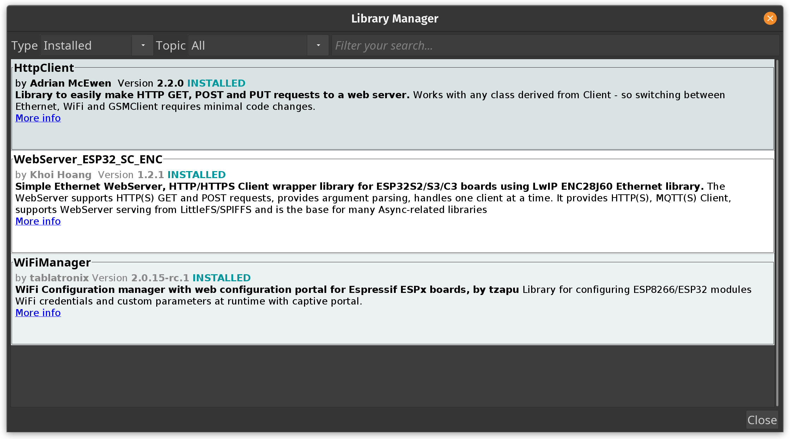
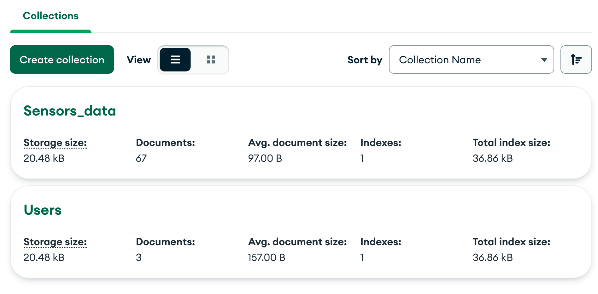

# GPS Sports Tracker IoT UniTN

## Table of Contents
  - [About the project](#about-the-project)
  - [Project layout](#project-layout)
  - [Basic](#basic)
    - [Basic Requirements](#basic-requirements)
      - [Basic Hardware](#basic-hardware)
      - [Basic Software](#basic-software)
      - [Linker options](#linker-options)
      - [Compiler options](#compiler-options)
      - [Basic Project wiring](#basic-project-wiring)
      - [Basic Get started](#basic-get-started)
  - [IoT Integration](#iot-integration)
    - [IoT Requirements](#iot-requirements)
      - [IoT Hardware](#iot-hardware)
      - [IoT Software](#iot-software)
      - [IoT Get started](#iot-get-started)
  - [Autors](#autors)
  - [Links](#links)
      
  
## About the project
Welcome to the GPS Sport Tracker!
This system has been designed to keep track of your sporting activities and routes. It utilizes a combination of microcontrollers and a GPS device to gather the data, which is then sent to the server for storage and later displayed on the website.
The system include the following components:
  - **MSP432** :Questo dispositivo campiona i dati ricevuti dal GPS,li elabora e li invia tramite UART a alla scheda ESP32.
  - **ESP32** : Questo microcontrollore riceve i dati tramite seriale e permette di connettere il sitema ad internet allo scopo di inviare i dati al web server.
  - **GPS Sensor**: questo sensore si connette ai satelliti, riceve e trasmette tramite seriale i dati ricevuti.
  
## Project layout
## Basic 
The Basic idea of the project is to develop a tracking system that enables you to see some statistics about your workout. The tracker can be used offline and the statistics are displayed on the LCD screen.
### Basic Requirements
#### Basic Hardware

You will need an `MSP432p401r` of the Texas Instrument company with its own expansion: the `BOOSTXL-EDUMKII`.You will also need a gps module.
#### Basic Software
In order to flash the program into the Texas Instrument components, you first need to install [Code Composer Studio](https://www.ti.com/tool/download/CCSTUDIO/12.2.0). 

The next step is to create a new CCS project, choosing the right target system (MSP432P401R), and paste all the files in `ccsProject/mainProjectFolder` and `ccsProject/sensorsLibraries` folders. You need also to exlude all the .c files, exept for the `main.c` and the one from the sensorsLibraries, from the build with a right click on them.

Finally to run the project you will need to add to the linker option and to the compiler option the driverlib library downloading it at this [link](https://drive.google.com/file/d/1krZfBNAFiE6yAChQfHZVE-b0wfuDitgV/view?usp=sharing). 

#### Linker options

<p align="center">

</p>

#### Compiler options

<p align="center">

</p>

#### Basic Project wiring
#### Basic Get started
## IoT Integration

This extension allows you to connect the basic system to the internet. In this way you can visualize all your data on a website with additional infomation that can't be displayed on the lcd screen.

### IoT Requirements
#### IoT Hardware

You will only need an ESP32 (ESP-WROOM-32)

#### IoT Software

1. NodeJS 
2. npm
3. Arduino IDE (version 1.8.19 is recommended)
5. MongoDB, MongoDBCompass

#### **NodeJS, npm**
How can I install all of this? Just follow next instructions.
To install `NodeJS` and `npm` you can easily follow the instruction on this [guide]( https://docs.npmjs.com/downloading-and-installing-node-js-and-npm).

Now that `NodeJS` and `npm` are installed, opne the `node_server` folder in your terminal and type this command

```
npm install
```
This command will install for you all the NodeJS packages needed.

#### **Arduino IDE**
Simply download the version for you on their [official web site](https://www.arduino.cc/en/software) and follow the installation procedure.

Once you have installed it you have to download some libraries to be able to operate on the ESP32 and manage http communication between NodeJS server and ESP32.

First of all open Arduino IDE and go to `Tools > Board > Boards Manager`, search for ESP32 by Espressif Systems and press install.

<p align="center">

</p>

Then we want to install the libraries required for the http comunication.

Go to `Tools > Manage Libraries` and search for:

1. HttpClient by Adrian McEwen
2. WebServer_ESP32_SC_ENC by Khoi Hoang
3. WiFiManager by tablatronix


<p align="center">

</p>

Nice, now your Arduino enviroment is ready.

#### **MongoDB, MongoDBCompass**

Now you have two solution:
1. running the database on your local machine
2. running the database on the cloud

You can create your local cluster with `MongoDB` and `MongoDBCompass` following this [guide](https://zellwk.com/blog/local-mongodb/) (how to create the database and how to connect it, don't look at how to connect from server NodeJS). This method is good if you have a home server but it is not the best if you haven't because your machine should run 24/7.

Otherwhise you can create your MongoDB account and create your cluster online. Follow this [guide](https://www.mongodb.com/basics/clusters/mongodb-cluster-setup) for that.

Once you have your cluster you have to create one database, witch will be composed of two collections:
1. Users
2. Sensors_data

It is very important to name these collection exactly in this way.

At the end you should have something like this in your Database.

<p align="center">

</p>

Now the configuration of the software is done, later we will have to modify some code!

#### IoT get started

Now we have to modify some code to make it work for you.

### Set NodeJS server IP adress in ESP32 code

We need to tell the ESP32 which address to send the data to so, in the `ESP32code` folder open `httpClient.cpp` in a text editor and change the 6th line. Insert the local IP address of the pc where the server will be running.

```c++
// node server address
String serverNode = "http://<yourServerIP>:3000";
```
Now ESP32 code is ready!


## Autors
  - [Nicolò Fadigà](https://github.com/HellNF)
    - NodeJS server
    - Esp32 code
    - MongoDB database and AWS server implementation
  - [Marco Panciera](https://github.com/panciut)
    - Javascript (React)  FrontEnd
    - C functions for conversion between strings format
  - [Marco Ruzzon](https://github.com/ruzzlft)
    - Interface with GPS on MSP432
    - Interface with UART on MSP432
  - [Alberto Balbinot](https://github.com/albibalb)
    - :camel:
## Links
  - [Demo Video]()
  - [Project presentation]()


