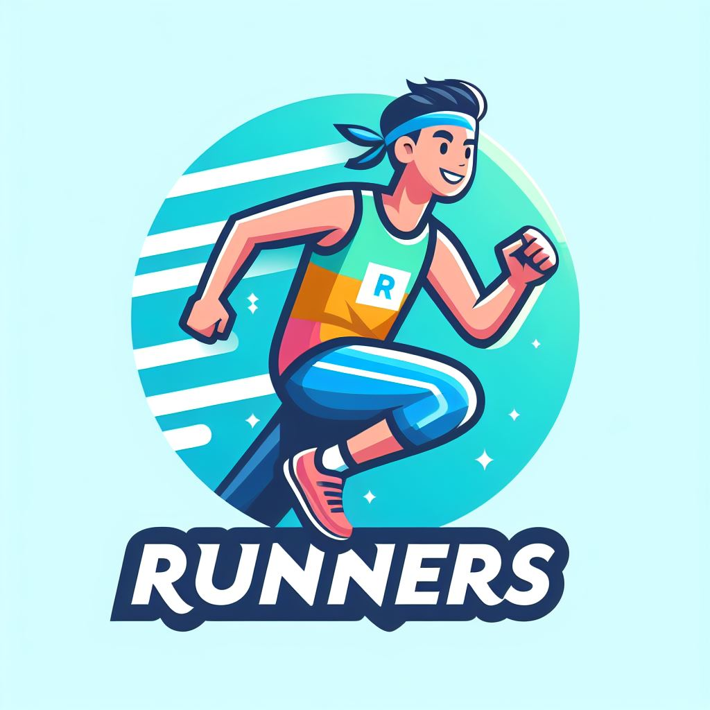
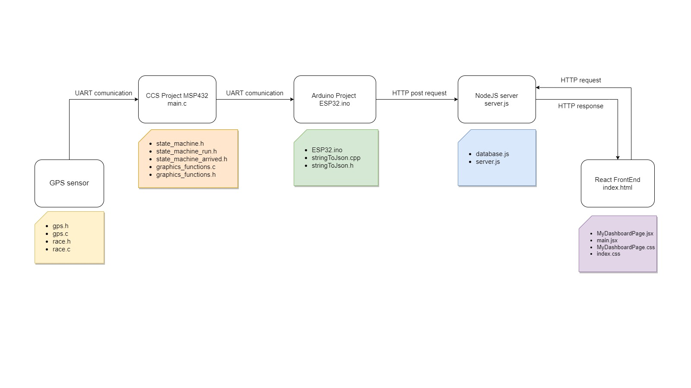
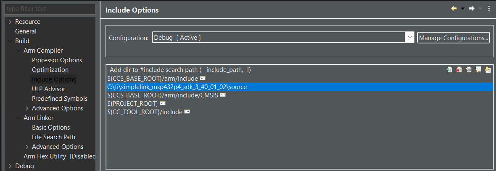
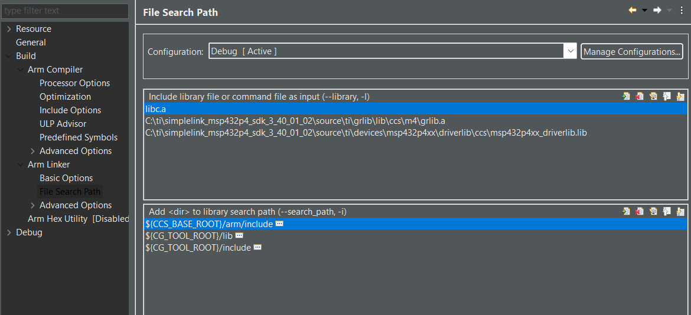
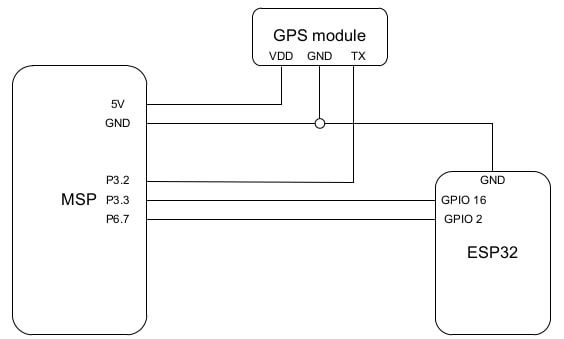
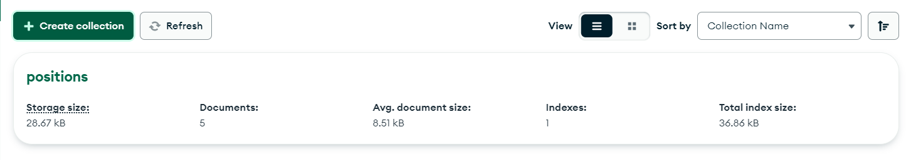

# GPS Sports Tracker IoT UniTN
<p align="center">

</p>

## Table of Contents
  - [About the project](#about-the-project)
  - [Project layout](#project-layout)
  - [Basic](#basic)
    - [Basic Requirements](#basic-requirements)
      - [Basic Hardware](#basic-hardware)
      - [Basic Software](#basic-software)
      - [Linker options](#linker-options)
      - [Compiler options](#compiler-options)
      - [Basic Project wiring](#basic-project-wiring)
      - [Basic Get started](#basic-get-started)
  - [IoT Integration](#iot-integration)
    - [IoT Requirements](#iot-requirements)
      - [IoT Hardware](#iot-hardware)
      - [IoT Software](#iot-software)
      - [IoT Get started](#iot-get-started)
  - [FrontEnd ](#frontend)
      - [Installation](#installation)
      - [Running the Application](#running-the-application)
      - [Dependencies](#dependencies)
      - [Using Visual Studio Code](#using-visual-studio-code)
  - [JSON Format](#json-format)
  - [Autors](#autors)
  - [Links](#links)
      
  
## About the project
Welcome to the GPS Sport Tracker!
This system has been designed to keep track of your sporting activities and routes. It utilizes a combination of microcontrollers and a GPS device to gather the data, which is then sent to the server for storage and later displayed on the website.
The system include the following components:
  - **MSP432** :This device samples the data received from the GPS, processes it, and sends it via UART to the ESP32 board.
  - **ESP32** : This microcontroller receives data via serial communication and enables the system to connect to the internet in order to send data to the web server.
  - **GPS Sensor**: This sensor connects to satellites, receives, and transmits the received data via serial communication.

The entire process starts by initiating the run from the MSP432 through the interaction menu. Subsequently, the board will start sampling data received from the GPS sensor every Tot seconds. Once the button to end the run is pressed, the collected data will be processed, extracting some useful statistics, and then sent to the ESP32 board, which was waiting until then. Upon receiving the data, it will format them into JSON format to make them suitable for insertion into the database. Once formatted, the program will check if it is connected to a Wi-Fi network, and if affirmative, it will send them to the server, which will insert them into the MongoDB database. On the backend side, the web server will handle various requests that can come from both ESP32 and the website. Finally, the website, through a GET request to the server, will obtain the run data and plot them on the map and display statistics in the dashboard.

## Project layout
<p align="center">

</p>

## Basic 
The Basic idea of the project is to develop a tracking system that enables you to see some statistics about your workout. The tracker can be used offline and the statistics are displayed on the LCD screen.
### Basic Requirements
#### Basic Hardware

You will need an `MSP432p401r` of the Texas Instrument company with its own expansion: the `BOOSTXL-EDUMKII`.You will also need a gps module.
#### Basic Software
In order to flash the program into the Texas Instrument components, you first need to install [Code Composer Studio](https://www.ti.com/tool/download/CCSTUDIO/12.2.0). 

The next step is to create a new CCS project, choosing the right target system (MSP432P401R), and paste all the files in `ccsProject/mainProjectFolder` and `ccsProject/sensorsLibraries` folders. You need also to exlude all the .c files, exept for the `main.c` and the one from the sensorsLibraries, from the build with a right click on them.

Finally to run the project you will need to add to the linker option and to the compiler option the driverlib library downloading it at this [link](https://drive.google.com/file/d/1krZfBNAFiE6yAChQfHZVE-b0wfuDitgV/view?usp=sharing). 

#### Linker options

<p align="center">

</p>

#### Compiler options

<p align="center">

</p>

#### Basic Project wiring
<p align="center">

</p>

#### Basic Get started
## IoT Integration

This extension allows you to connect the basic system to the internet. In this way you can visualize all your data on a website with additional infomation that can't be displayed on the lcd screen.

### IoT Requirements
#### IoT Hardware

You will only need an ESP32 (ESP-WROOM-32)

#### IoT Software

1. NodeJS 
2. npm
3. Arduino IDE (version 1.8.19 is recommended)
5. MongoDB, MongoDBCompass

#### **NodeJS, npm**
How can I install all of this? Just follow next instructions.
To install `NodeJS` and `npm` you can easily follow the instruction on this [guide]( https://docs.npmjs.com/downloading-and-installing-node-js-and-npm).

Now that `NodeJS` and `npm` are installed, opne the `node_server` folder in your terminal and type this command

```
npm install
```
This command will install for you all the NodeJS packages needed.

#### **Arduino IDE**
Simply download the version for you on their [official web site](https://www.arduino.cc/en/software) and follow the installation procedure.

Once you have installed it you have to download some libraries to be able to operate on the ESP32 and manage http communication between NodeJS server and ESP32.

First of all open Arduino IDE and go to `Tools > Board > Boards Manager`, search for ESP32 by Espressif Systems and press install.

<p align="center">

</p>


#### **MongoDB, MongoDBCompass**

Now you have two solution:
1. running the database on your local machine
2. running the database on the cloud

You can create your local cluster with `MongoDB` and `MongoDBCompass` following this [guide](https://zellwk.com/blog/local-mongodb/) (how to create the database and how to connect it, don't look at how to connect from server NodeJS). This method is good if you have a home server but it is not the best if you haven't because your machine should run 24/7.

Otherwhise you can create your MongoDB account and create your cluster online. Follow this [guide](https://www.mongodb.com/basics/clusters/mongodb-cluster-setup) for that.

Once you have your cluster you have to create one database, witch will be composed of one collection:
  - positions


At the end you should have something like this in your Database.

<p align="center">

</p>
You have to use the exact name of the collection.
Now the configuration of the software is done, later we will have to modify some code!

#### IoT get started

Now we have to install the Esp32 windows drivers in order to let to the OS to see the board. You can follow this [**guide**](https://www.lelezapp.it/installare-driver-cp2102-per-programmare-esp32-in-windows/).
##### .env file for database URL
Now we have to create a `.env` file in the `webServer` folder.
Once you have created it, open it and in the first line write:
```
DATABASE_URL=mongodb+srv://<username>:<password>@<clusterName>.[randomCharacter].mongodb.net
``` 
automatically MongoDB will provide you the right URL, in case you have created your cluster online it will look like the example above.
##### Set NodeJS server IP address in ESP32 code

We need to tell the ESP32 which address to send the data to so, in the `ESP32 Forwarding` folder open `ESP32.ino` in a text editor and change the following lines.Fill `ssid` and `pwd` with the credentials of your Wifi Network. 
Insert the public IP of your server,in our case we used AWS to host the system, in other case if you host it on your pc use the local IP address.

```c++
char* ssid="yourWifiNetwork"; //name of the wifi 
char* pwd="yourPassword"; // password of the wifi
char* ServerAddress="yourServerAddress" ;//address of the Nodejs server
```

Now ESP32 code is ready!


## FrontEnd

This is a Website that fetches data from an API on the server, displays it on a Leaflet map, and renders a Chart.js chart based on the selected data.

following the guide below you will be able to modify and test the code.

### Installation

To run this application locally, you'll need to have Node.js and npm (Node Package Manager) installed. Follow these steps:

1. **Install Node.js and npm:** If you haven't already installed Node.js and npm, you can download and install them from [here](https://nodejs.org/).

2. **Clone the repository:** Clone this repository to your local machine using Git:

   ```bash
   git clone https://github.com/albibalbi/ESIT.git
   ```

3. **Navigate to the project directory:** Change into the project directory:

   ```bash
   cd ESIT/FrontEnd
   ```

4. **Install dependencies:** Run the following command to install the required dependencies:

   ```bash
   npm install
   ```

   This will install all the necessary packages listed in the `package.json` file.

### Running the Application

Once you have installed the dependencies, you can run the application locally. Follow these steps:

1. **Start the development server:** Run the following command to start the development server:

   ```bash
   npm run dev
   ```

2. **View the application:** Open your web browser and navigate to [http://localhost:4000](http://localhost:4000) to view the application.

3. **Change the source of the data** We are using data fetched from our server but if you want to get it form somewhere else you just need to change this line of code in MyDashboard.jsx and update the URL.

   ```javascrip
    const response = await fetch('http://13.60.21.191:3000/api/');
   ```
   

### Dependencies

The following dependencies are used in this project:

- [React](https://reactjs.org/): A JavaScript library for building user interfaces.
- [Leaflet](https://leafletjs.com/): An open-source JavaScript library for interactive maps.
- [Chart.js](https://www.chartjs.org/): Simple yet flexible JavaScript charting for designers & developers.
- [axios](https://github.com/axios/axios): Promise-based HTTP client for the browser and Node.js.
- [react-leaflet](https://react-leaflet.js.org/): React components for Leaflet maps.
- [react-chartjs-2](https://www.npmjs.com/package/react-chartjs-2): React wrapper for Chart.js.
- [leaflet](https://www.npmjs.com/package/leaflet): An open-source JavaScript library for mobile-friendly interactive maps.

### Using Visual Studio Code

[Visual Studio Code](https://code.visualstudio.com/) is a popular code editor for building and debugging modern web and cloud applications. Here's how to install and use Visual Studio Code:

1. **Download Visual Studio Code:** Download and install Visual Studio Code from the [official website](https://code.visualstudio.com/).

2. **Open the project:** Launch Visual Studio Code and open the `MyDashboardApp` project directory.

3. **Install recommended extensions:** Visual Studio Code has a rich ecosystem of extensions that can enhance your development experience. You may consider installing some recommended extensions for React development, such as:
   - [ESLint](https://marketplace.visualstudio.com/items?itemName=dbaeumer.vscode-eslint): Provides linting capabilities for JavaScript and JSX files.
   - [Prettier - Code formatter](https://marketplace.visualstudio.com/items?itemName=esbenp.prettier-vscode): Automatically formats your code according to configured rules.
   - [Debugger for Chrome](https://marketplace.visualstudio.com/items?itemName=msjsdiag.debugger-for-chrome): Allows you to debug your React applications running in the Chrome browser.

4. **Start coding:** You can now start coding your React application using Visual Studio Code. Use features like IntelliSense, code navigation, and debugging to streamline your development workflow.

## JSON Format

The data exchanged in this project follows a specific JSON format. Below is an example of the JSON structure used:

```json
{
  "date": "15/02/24:12:12:12",
  "duration": 3600,
  "distance": 5000,
  "avg_speed": 6.94,
  "altitude_diff": 100,
  "positions": [
    {
      "lat": 45.1234,
      "lng": 10.5678,
      "alt": 100
    },
    {
      "lat": 45.2345,
      "lng": 10.6789,
      "alt": 105
    }
  ]
}
```
- date: The date of the recorded activity.
- duration: Duration of the activity in seconds.
- distance: Distance covered during the activity in meters.
- avg_speed: Average speed during the activity in km/h.
- altitude_diff: Altitude difference during the activity in meters.
- positions: An array of objects representing latitude, longitude, and altitude at different points during the activity.

## Autors
  - [Nicolò Fadigà](https://github.com/HellNF)
    - NodeJS server
    - Esp32 code (UART reciver , HTTP client)
    - Server deploy (Database and AWS server)
  - [Marco Panciera](https://github.com/panciut)
    - Javascript (React)  FrontEnd
    - C functions for conversion between strings format
  - [Marco Ruzzon](https://github.com/ruzzlft)
    - Interface with GPS on MSP432
    - Interface with UART on MSP432
  - [Alberto Balbinot](https://github.com/albibalb)
    - MSP432 controls
    - Display data on LCD screen.
## Links
  - [Demo Video]()
  - [Project presentation]()


