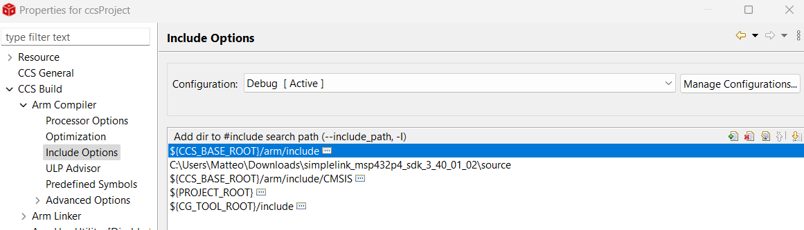

# GPS Sports Tracker IoT UniTN

## Table of Contents
  - [About the project](#about-the-project)
  - [Project layout](#project-layout)
  - [Basic](#basic)
    - [Basic Requirements](#basic-requirements)
      - [Basic Hardware](#basic-hardware)
      - [Basic Software](#basic-software)
      - [Linker options](#linker-options)
      - [Compiler options](#compiler-options)
      - [Basic Project wiring](#basic-project-wiring)
      - [Basic Get started](#basic-get-started)
  - [IoT Integration](#iot-integration)
    - [IoT Requirements](#iot-requirements)
      - [IoT Hardware](#iot-hardware)
      - [IoT Software](#iot-software)
      - [IoT Get started](#iot-get-started)
  - [Autors](#autors)
  - [Links](#links)
      
  
## About the project

## Project layout
## Basic 
### Basic Requirements
#### Basic Hardware

You will need an `MSP432p401r` of the Texas Instrument company with its own expansion: the `BOOSTXL-EDUMKII`.You will also need a gps module.
#### Basic Software
In order to flash the program into the Texas Instrument components, you first need to install [Code Composer Studio](https://www.ti.com/tool/download/CCSTUDIO/12.2.0). 

The next step is to create a new CCS project, choosing the right target system (MSP432P401R), and paste all the files in `ccsProject/mainProjectFolder` and `ccsProject/sensorsLibraries` folders. You need also to exlude all the .c files, exept for the `main.c` and the one from the sensorsLibraries, from the build with a right click on them.

Finally to run the project you will need to add to the linker option and to the compiler option the driverlib library downloading it at this [link](https://drive.google.com/file/d/1krZfBNAFiE6yAChQfHZVE-b0wfuDitgV/view?usp=sharing). 

#### Linker options

#### Compiler options
#### Basic Project wiring
#### Basic Get started
## IoT Integration
### IoT Requirements
#### IoT Hardware
#### IoT Software
#### IoT get started

## Autors
  - [Nicolò Fadigà](https://github.com/HellNF)
    - NodeJS server
    - Esp32 code
    - MongoDB database and AWS server implementation
  - [Marco Panciera](https://github.com/panciut)
    - React FrontEnd
  - [Marco Ruzzon](https://github.com/ruzzlft)
    - qualcosa
  - [Alberto Balbinot](https://github.com/albibalbi)
    - qualcosa
## Links
  - [Demo Video]()
  - [Project presentation]()

